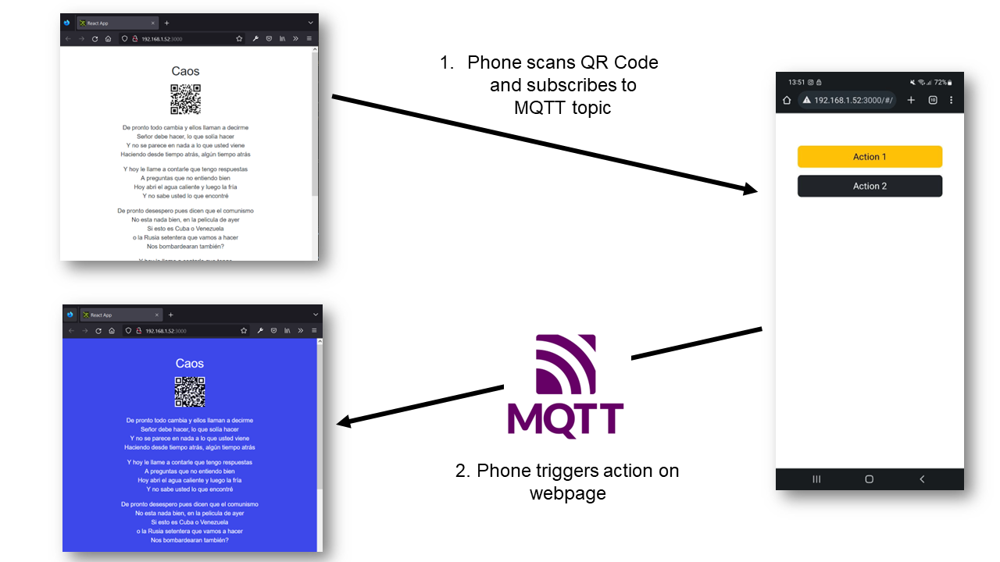

# react-qr-mqtt

A simple React app that creates a QR code to be scanned with a smartphone. This opens another page on the phone, with a couple of buttons that trigger actions on the original page (via MQTT).

This is a building block of my [personal website](https://pointless.xmp.systems/).

**Try it out**: [Live demo](https://linomp.github.io/react-qr-mqtt/)




## Setup
If you don't already have it, install yarn (globally): 
```bash
npm install -g yarn
```
Then:
```bash
yarn install
yarn start
```

See the `.env` files for broker configuration.

Currently, the broker listed there is a [public Mosquitto MQTT broker](https://test.mosquitto.org/) provided by Eclipse for testing (supports MQTT over secure web sockets).
